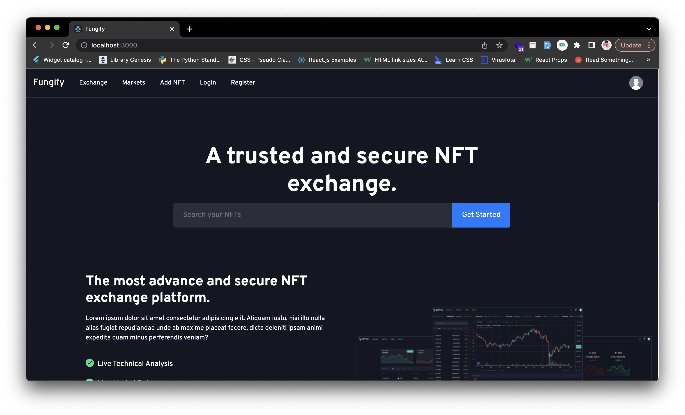
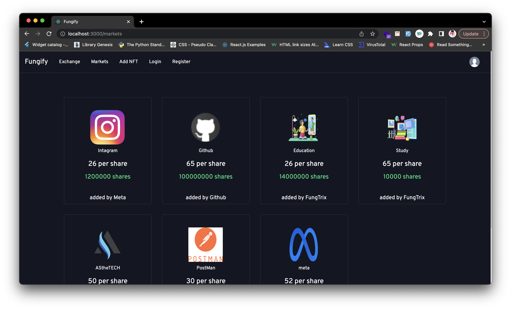
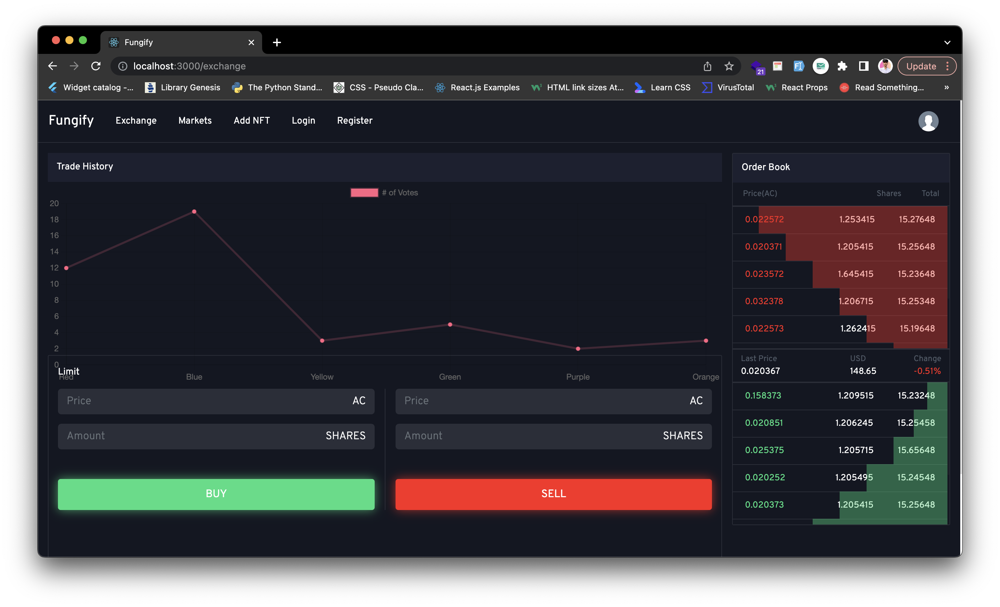
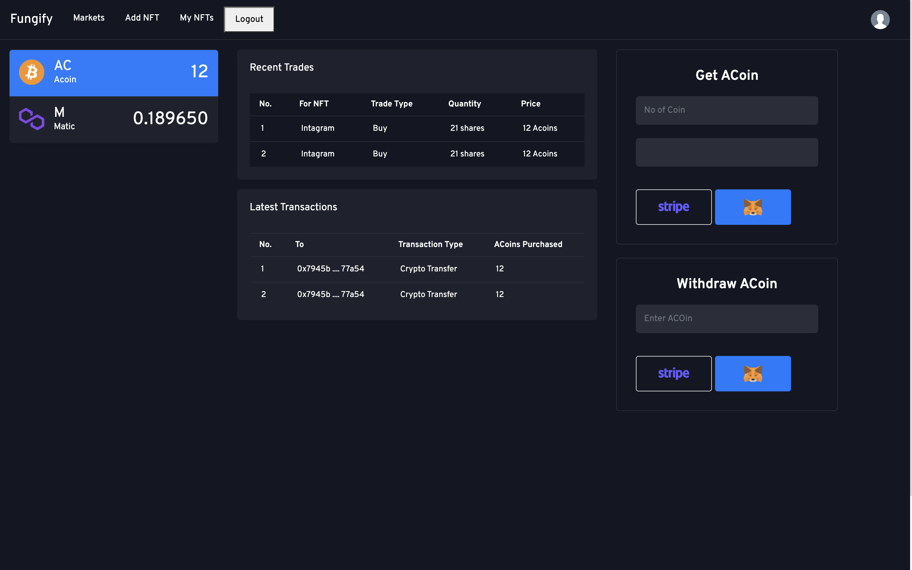
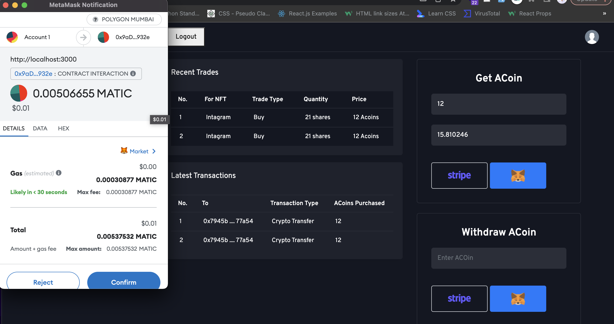
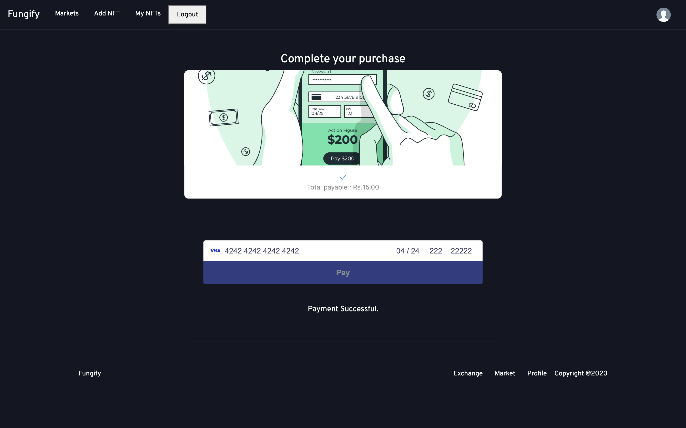
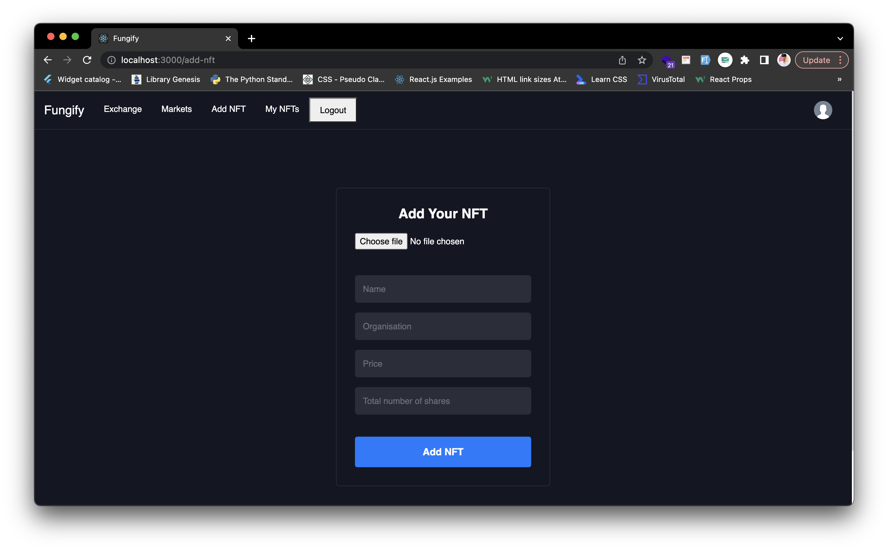

# Unlock the power of shared ownership with fractional NFT trading.

### Team name: Dark Coders

## Team members

- Abhay Ubhale - abhayubhale.30@gmail.com
- Neel Dandiwala - neeldandi@gmail.com
- Om Jadhav - omjadhav963@gmail.com
- Hasnain Sayyed - hasnainsayyed833@gmail.com

## Description

- Introducing Fractional NFT Trading - a revolutionary new concept in the world of NFTs.
- With famous NFT’s selling for millions of dollars, buying or selling an entire piece can be out of reach for most investors.
- Our platform allows you to divide an NFT into smaller, fractional parts, making it more accessible and affordable for everyone to trade.
- No longer will you have to miss out on owning a piece of digital art or collectible because of the high cost. Invest in the NFT market with confidence and flexibility with Fractional NFT Trading!

## Links

- GitHub Repo link: [Link to repository](https://github.com/AS-the-Tech/fungtrix-client)

## Technology stack

Tools and technologies that you learnt and used in the project.

1. React JS
2. Node JS
3. Express JS
4. Solidity
5. Polygon
6. Cloudinary
7. MongoDB
8. Web3.js
9. Metamask
10. Ganache
11. Firebase RealTime DataBase
12. Stripe

## Usage

- If one wants to invest in an application or a particular project of a company, the common way is to buy the shares of that company.
- It might happen that your prediction on the project was right which should have gain you profits. Although company itself might be suffering loss; in turn the investors also suffer loss.
- To overcome this, the proposed system can produce NFT’s which can sustain such cases. It might also be the case that the company is dissolve but it won’t affect the NFT and its shares. It will continue to exist until the investors of that NFT wants to trade it.
- The project would create opportunities for small businesses and startups to get themselves listed without having to worry about their company formation structure
- The company owners can benefit by keeping an amount of shares with themselves and gain royalty

## Future scope

- List ACoin currency in other coin exchange platform.
- Developing a full-fledged NFT trading platform.
- Lending the NFT shares to earn interest.
- Future and option trading of NFT shares.

## Screenshots

|  |  |  |  |
| :------------------: | :----------------------: | :-------------------: | :---------------------: |
|      Home Page       |         NFT Page         |     Shares Chart      |      Profile Page       |

|  |  |  |  |
| :----------------------: | :--------------------: | :-----------------------: | :--------------------: |
|        Get ACoin         |     Stripe Payment     |        Burn ACoin         |      Add NFT Page      |
